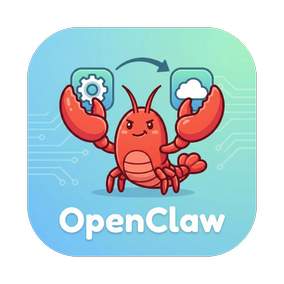
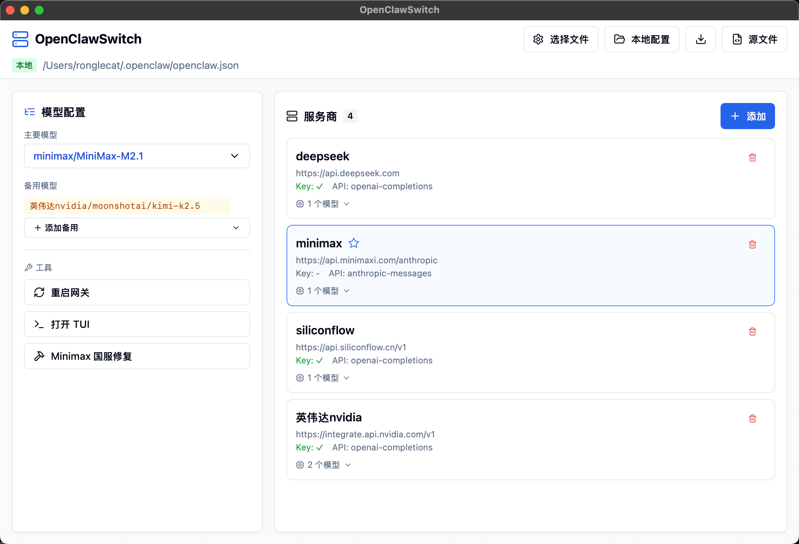
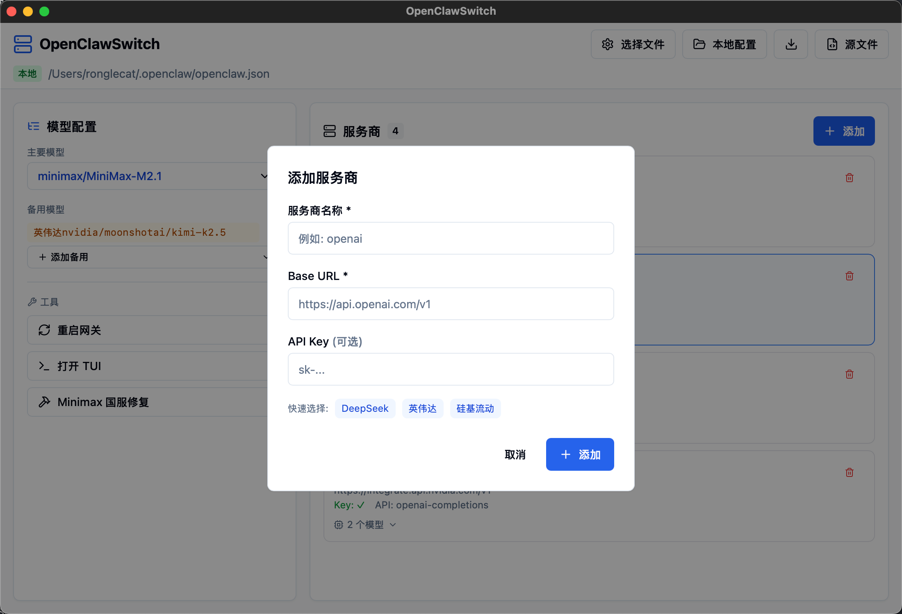

<p align="center">
  
</p>

<h1 align="center">OpenClawSwitch</h1>

<p align="center">
  English | <a href="README.md">简体中文</a>
</p>

<p align="center">
  A modern, lightweight configuration manager for OpenClaw
</p>

<p align="center">
  
</p>

<p align="center">
  
</p>

---

## Overview

OpenClawSwitch is a visual configuration manager designed for **OpenClaw**, built with Tauri + Vue 3. Manage your AI model configurations effortlessly through a clean and intuitive graphical interface - no more manual JSON editing.

## Features

- **Visual Configuration** - Manage configurations through a GUI instead of editing JSON manually
- **Multi-Provider Support** - Support for OpenAI, Anthropic, Ollama, and more
- **Quick Model Switching** - Switch primary and fallback models with one click
- **Local/Remote Mode** - Auto-save for local configs, manual management for remote files
- **Cross-Platform** - Windows, macOS (Apple Silicon/Intel)
- **Lightweight** - Only 3-5MB package size, low memory footprint

## Installation

### Download Release

Go to [Releases](https://github.com/RongleCat/OpenClawSwitch/releases) to download the installer for your platform:

| Platform | File |
|----------|------|
| Windows | `OpenClawSwitch_x.x.x_x64-setup.exe` or `.msi` |
| macOS (Apple Silicon) | `OpenClawSwitch_x.x.x_aarch64.dmg` |
| macOS (Intel) | `OpenClawSwitch_x.x.x_x64.dmg` |

> **macOS Users**: Since the app is not signed, run this command before first launch:
> ```bash
> xattr -c /Applications/OpenClawSwitch.app
> ```

### Build from Source

```bash
# Clone the repository
git clone https://github.com/RongleCat/OpenClawSwitch.git
cd OpenClawSwitch

# Install dependencies
npm install

# Development mode
npm run tauri:dev

# Build for production
npm run tauri:build
```

**Build Requirements**:
- Node.js 18+
- Rust 1.70+
- Windows: [Microsoft C++ Build Tools](https://visualstudio.microsoft.com/visual-cpp-build-tools/)
- macOS: `xcode-select --install`

## Usage

### 1. Launch the App

The app automatically loads the default config file at `~/.openclaw/openclaw.json`.

### 2. Add a Provider

Click the "Add" button and fill in the provider details:

| Field | Description | Example |
|-------|-------------|---------|
| Provider Name | Custom identifier | `openai` |
| Base URL | API base URL | `https://api.openai.com/v1` |
| API Key | Optional, can also be set via environment variable | `sk-xxx` |

**Quick Fill**: Click `OpenAI` / `Anthropic` / `Ollama` buttons to auto-fill common configurations.

### 3. Add Models

Click the "+" button on a provider card to add model IDs like `gpt-4o` or `claude-sonnet-4-20250514`.

### 4. Switch Models

- **Primary Model**: Select from the dropdown in the "Model Configuration" section
- **Fallback Models**: Click "Add Fallback" to select backup models

### 5. Tools

- **Restart Gateway** - Restart the OpenClaw gateway service
- **Open TUI** - Open OpenClaw terminal interface

## Configuration

Config file location:
- **Windows**: `%USERPROFILE%\.openclaw\openclaw.json`
- **macOS**: `~/.openclaw/openclaw.json`

Example configuration:
```json
{
  "models": {
    "providers": {
      "openai": {
        "baseUrl": "https://api.openai.com/v1",
        "apiKey": "sk-..."
      }
    }
  },
  "agent": {
    "model": "openai/gpt-4o"
  }
}
```

## Tech Stack

| Category | Technology |
|----------|------------|
| Frontend | Vue 3 + TypeScript + Vite |
| UI | Tailwind CSS + Lucide Icons |
| Desktop Framework | Tauri 1.5 |
| Backend | Rust |

## License

[MIT License](LICENSE)

## Contributing

Issues and Pull Requests are welcome!

## Links

- [OpenClaw](https://github.com/miaoxworld/openclaw-manager)
- [Tauri](https://tauri.app/)
- [Vue 3](https://vuejs.org/)
